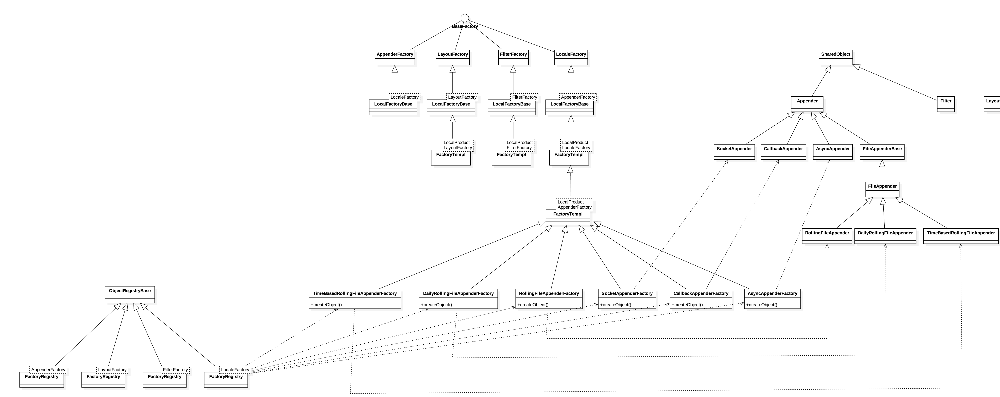

## [Module Funciton]:
Acomplish the core objects(apender/layout/Filter/Locale) auto creating    
## [Files]:
factory.h/factory.cxx
## [Class Diagram]:

## [Analysis]:
- Auther use [Factory Method Desigin Pattern](https://en.wikipedia.org/wiki/Factory_method_pattern) to Create core objects. For example, the *`Appender`* Class is the Product, and the *`RollingFileAppender`* Class which inherit from *`Appender`* is the ConcreteProduct, mean while, *`AppenderFactory`* Class is the Creator, and *`RollingFileAppenderFacory`* is ConcreteCreator which inherit from *`AppenderFacory`*.